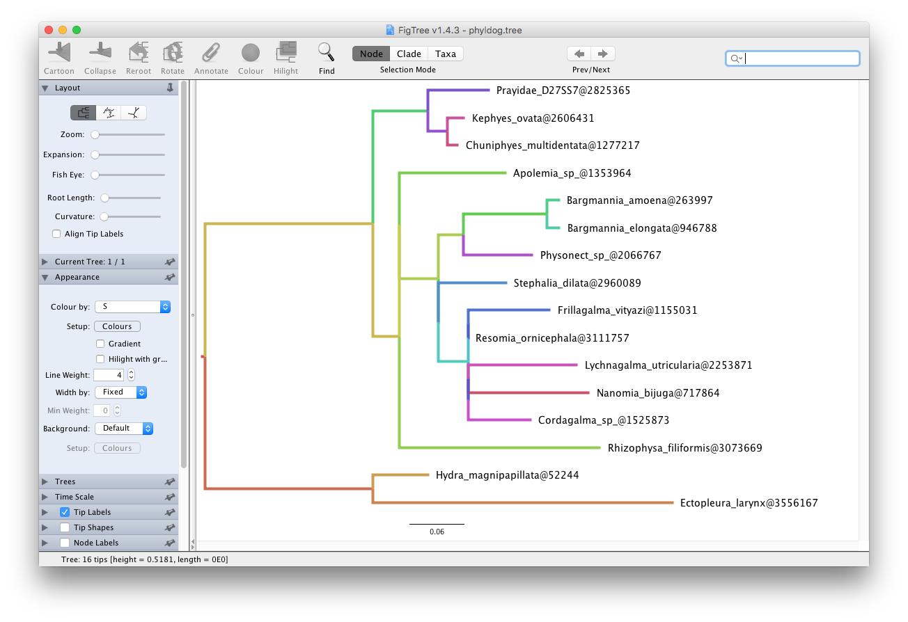
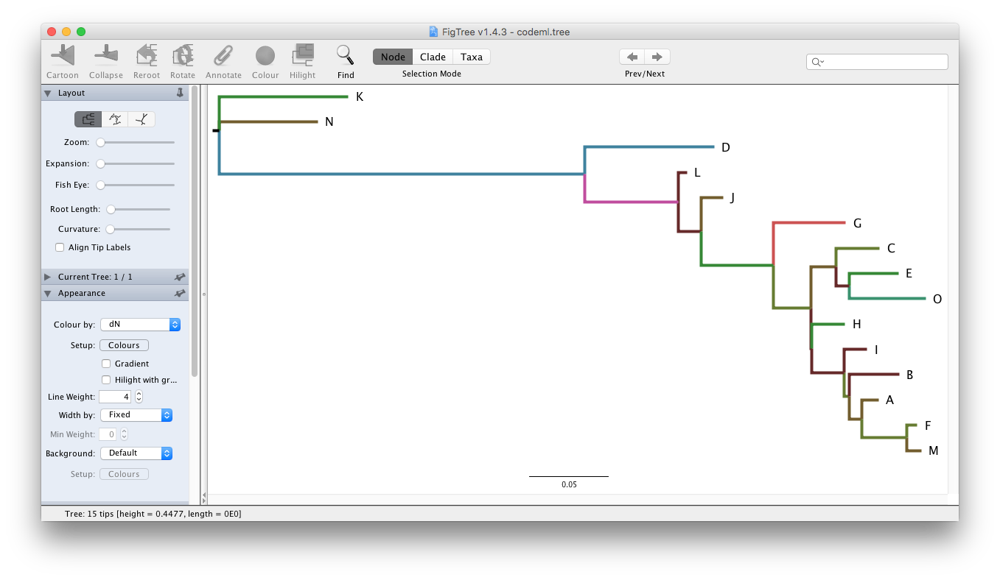

\newpage

# Exporting tree with data {#chapter3}


```{r echo=FALSE, results="hide", message=FALSE}
library('jsonlite')
library("treeio")
```

```{r echo=FALSE}
options(show_data_for_treedata = FALSE)
```


## Introduction

The `r Biocpkg("treeio")` package [@wang_treeio_2020] supports parsing various phylogenetic tree file formats including software outputs that contain evolutionary evidence. Some of the formats are just log files
(*e.g.* `r pkg_paml`
and `r pkg_r8s` output), while some of the others are
non-standard formats (*e.g.* `r pkg_beast`
and `r pkg_mrbayes` output that introduce square
bracket, which was reserved to store comment in standard Nexus format, to store
inferences). With `r Biocpkg("treeio")`, we are
now able to parse these files to extract phylogenetic trees and map associated
data on the tree structure. Exporting tree structure is easy, users can use
the `as.phyo()` method defined in `r Biocpkg("treeio")` to
convert a `treedata` object to a `phylo` object then using `write.tree()` or
`write.nexus()` implemented
in `r CRANpkg("ape")` package
[@paradis_ape_2004] to export the tree structure as Newick text or Nexus file.
This is quite useful for converting non-standard formats to a standard format and
for extracting trees from software outputs, such as log files.

However, exporting a tree with associated data is still challenging. These
associated data can be parsed from analysis programs or obtained from external
sources (*e.g.* phenotypic data, experimental data, and clinical data). The major
obstacle here is that there is no standard format designed for storing a
tree with data. [NeXML](http://www.nexml.org/) [@vos_nexml:_2012] may be the most
flexible format. However, it is currently not widely supported. Most of the
analysis programs in this field rely extensively on Newick string and Nexus
format. In my opinion, although [BEAST Nexus
format](http://beast.community/nexus_metacomments) may not be the best solution,
it is currently a good approach for storing heterogeneous associated data. The
beauty of the format is that all the annotated elements are stored within square
brackets, which are reserved for comments. So that the file can be parsed as
standard Nexus by ignoring annotated elements and existing programs should be
able to read it.

## Exporting Tree Data to *BEAST* Nexus Format


### Exporting/converting software output

The `r Biocpkg("treeio")` package [@wang_treeio_2020] provides the `write.beast()` function to export `treedata` object as BEAST Nexus file [@bouckaert_beast_2014].
With `r Biocpkg("treeio")`, it is easy to convert
software output to BEAST format if the output can be parsed
by `r Biocpkg("treeio")` (see [Chapter 1](#chapter1)). 

Here is an example of converting NHX file to BEAST format:

```{r comment=NA, eval=FALSE}
nhxfile <- system.file("extdata/NHX", "phyldog.nhx", package="treeio")
nhx <- read.nhx(nhxfile)
# write.beast(nhx, file = "phyldog.tree")
write.beast(nhx)
```

```{r echo=FALSE, comment=NA}
x <- '#NEXUS
[R-package treeio, Thu Oct 14 11:24:19 2021]

BEGIN TAXA;
	DIMENSIONS NTAX = 16;
	TAXLABELS
		Prayidae_D27SS7@2825365
		Kephyes_ovata@2606431
		Chuniphyes_multidentata@1277217
		Apolemia_sp_@1353964
		Bargmannia_amoena@263997
		Bargmannia_elongata@946788
		Physonect_sp_@2066767
		Stephalia_dilata@2960089
		Frillagalma_vityazi@1155031
		Resomia_ornicephala@3111757
		Lychnagalma_utricularia@2253871
		Nanomia_bijuga@717864
		Cordagalma_sp_@1525873
		Rhizophysa_filiformis@3073669
		Hydra_magnipapillata@52244
		Ectopleura_larynx@3556167
	;
END;
BEGIN TREES;
	TRANSLATE
		1	Prayidae_D27SS7@2825365,
		2	Kephyes_ovata@2606431,
		3	Chuniphyes_multidentata@1277217,
		4	Apolemia_sp_@1353964,
		5	Bargmannia_amoena@263997,
		6	Bargmannia_elongata@946788,
		7	Physonect_sp_@2066767,
		8	Stephalia_dilata@2960089,
		9	Frillagalma_vityazi@1155031,
		10	Resomia_ornicephala@3111757,
		11	Lychnagalma_utricularia@2253871,
		12	Nanomia_bijuga@717864,
		13	Cordagalma_sp_@1525873,
		14	Rhizophysa_filiformis@3073669,
		15	Hydra_magnipapillata@52244,
		16	Ectopleura_larynx@3556167
	;
	TREE * UNTITLED = [&R] (((1[&Ev=S,ND=0,S=58]:0.0682841,(2[&Ev=S,ND=1,
S=69]:0.0193941,3[&Ev=S,ND=2,S=70]:0.0121378)[&Ev=S,ND=3,S=60]:0.0217782)
[&Ev=S,ND=4,S=36]:0.0607598,((4[&Ev=S,ND=9,S=31]:0.11832,(((5[&Ev=S,ND=10,
S=37]:0.0144549,6[&Ev=S,ND=11,S=38]:0.0149723)[&Ev=S,ND=12,S=33]:0.0925388,
7[&Ev=S,ND=13,S=61]:0.077429)[&Ev=S,ND=14,S=24]:0.0274637,(8[&Ev=S,ND=15,
S=52]:0.0761163,((9[&Ev=S,ND=16,S=53]:0.0906068,10[&Ev=S,ND=17,S=54]:1e-06)
[&Ev=S,ND=18,S=45]:1e-06,((11[&Ev=S,ND=19,S=65]:0.120851,12[&Ev=S,ND=20,
S=71]:0.133939)[&Ev=S,ND=21,S=56]:1e-06,13[&Ev=S,ND=22,S=64]:0.0693814)
[&Ev=S,ND=23,S=46]:1e-06)[&Ev=S,ND=24,S=40]:0.0333823)[&Ev=S,ND=25,S=35]:
1e-06)[&Ev=D,ND=26,S=24]:0.0431861)[&Ev=S,ND=27,S=19]:1e-06,14[&Ev=S,ND=28,
S=26]:0.22283)[&Ev=S,ND=29,S=17]:0.0292362)[&Ev=D,ND=8,S=17]:0.185603,
(15[&Ev=S,ND=5,S=16]:0.0621782,16[&Ev=S,ND=6,S=15]:0.332505)[&Ev=S,ND=7,
S=12]:0.185603)[&Ev=S,ND=30,S=9];
END;'

writeLines(x)
```

Another example of converting `r pkg_codeml` output to BEAST format:

```{r comment=NA, eval=FALSE}
mlcfile <- system.file("extdata/PAML_Codeml", "mlc", package="treeio")
ml <- read.codeml_mlc(mlcfile)
# write.beast(ml, file = "codeml.tree")
write.beast(ml) # output not shown
```

```{r echo=FALSE, comment=NA, eval=FALSE}
x <- '#NEXUS
[R-package treeio, Thu Oct 14 11:27:48 2021]

BEGIN TAXA;
	DIMENSIONS NTAX = 15;
	TAXLABELS
		A
		B
		C
		D
		E
		F
		G
		H
		I
		J
		K
		L
		M
		N
		O
	;
END;
BEGIN TREES;
	TRANSLATE
		1	A,
		2	B,
		3	C,
		4	D,
		5	E,
		6	F,
		7	G,
		8	H,
		9	I,
		10	J,
		11	K,
		12	L,
		13	M,
		14	N,
		15	O
	;
	TREE * UNTITLED = [&U] (11[&t=0.082,N=1514.9,S=633.1,dN_vs_dS=0.0224,
dN=0.002,dS=0.0878,N_x_dN=3,S_x_dS=55.6]:0.081785,14[&t=0.062,N=1514.9,
S=633.1,dN_vs_dS=0.0095,dN=7e-04,dS=0.0689,N_x_dN=1,S_x_dS=43.6]:0.062341,
(4[&t=0.082,N=1514.9,S=633.1,dN_vs_dS=0.0385,dN=0.0033,dS=0.0849,N_x_dN=5,
S_x_dS=53.8]:0.082021,(12[&t=0.006,N=1514.9,S=633.1,dN_vs_dS=1e-04,dN=0,
dS=0.0062,N_x_dN=0,S_x_dS=3.9]:0.005508,(10[&t=0.014,N=1514.9,S=633.1,
dN_vs_dS=0.0457,dN=7e-04,dS=0.0143,N_x_dN=1,S_x_dS=9]:0.013996,(7[&t=0.046,
N=1514.9,S=633.1,dN_vs_dS=0.1621,dN=0.006,dS=0.0373,N_x_dN=9.2,S_x_dS=23.6]:
0.045746,((3[&t=0.028,N=1514.9,S=633.1,dN_vs_dS=0.0461,dN=0.0013,dS=0.0282,
N_x_dN=2,S_x_dS=17.9]:0.02773,(5[&t=0.031,N=1514.9,S=633.1,dN_vs_dS=0.0641,
dN=0.002,dS=0.0305,N_x_dN=3,S_x_dS=19.3]:0.031104,15[&t=0.048,N=1514.9,
S=633.1,dN_vs_dS=0.0538,dN=0.0026,dS=0.0485,N_x_dN=4,S_x_dS=30.7]:0.048389)
23[&t=0.008,N=1514.9,S=633.1,dN_vs_dS=1e-04,dN=0,dS=0.0094,N_x_dN=0,
S_x_dS=6]:0.008328)22[&t=0.016,N=1514.9,S=633.1,dN_vs_dS=0.0395,dN=7e-04,
dS=0.0165,N_x_dN=1,S_x_dS=10.4]:0.015959,(8[&t=0.021,N=1514.9,S=633.1,
dN_vs_dS=0.1028,dN=0.002,dS=0.0191,N_x_dN=3,S_x_dS=12.1]:0.021007,
(9[&t=0.015,N=1514.9,S=633.1,dN_vs_dS=1e-04,dN=0,dS=0.0167,N_x_dN=0,
S_x_dS=10.6]:0.014739,(2[&t=0.032,N=1514.9,S=633.1,dN_vs_dS=1e-04,
dN=0,dS=0.0358,N_x_dN=0,S_x_dS=22.7]:0.031643,(1[&t=0.01,N=1514.9,
S=633.1,dN_vs_dS=0.0646,dN=7e-04,dS=0.0101,N_x_dN=1,S_x_dS=6.4]:0.01034,
(6[&t=0.007,N=1514.9,S=633.1,dN_vs_dS=0.298,dN=0.0013,dS=0.0044,N_x_dN=2,
S_x_dS=2.8]:0.006649,13[&t=0.009,N=1514.9,S=633.1,dN_vs_dS=0.0738,dN=7e-04,
dS=0.0088,N_x_dN=1,S_x_dS=5.6]:0.009195)28[&t=0.028,N=1514.9,S=633.1,
dN_vs_dS=0.0453,dN=0.0013,dS=0.0289,N_x_dN=2,S_x_dS=18.3]:0.028303)27
[&t=0.008,N=1514.9,S=633.1,dN_vs_dS=0.0863,dN=7e-04,dS=0.0076,N_x_dN=1,
S_x_dS=4.8]:0.008072)26[&t=0.003,N=1514.9,S=633.1,dN_vs_dS=1.5591,dN=0.0013,
dS=8e-04,N_x_dN=2,S_x_dS=0.5]:0.0035)25[&t=0.02,N=1514.9,S=633.1,
dN_vs_dS=1e-04,dN=0,dS=0.023,N_x_dN=0,S_x_dS=14.6]:0.020359)24[&t=0.001,
N=1514.9,S=633.1,dN_vs_dS=1e-04,dN=0,dS=6e-04,N_x_dN=0,S_x_dS=0.4]:0.000555)
21[&t=0.024,N=1514.9,S=633.1,dN_vs_dS=0.0549,dN=0.0013,dS=0.0237,N_x_dN=2,
S_x_dS=15]:0.023675)20[&t=0.046,N=1514.9,S=633.1,dN_vs_dS=0.0419,dN=0.002,
dS=0.047,N_x_dN=3,S_x_dS=29.8]:0.045745)19[&t=0.015,N=1514.9,S=633.1,
dN_vs_dS=1e-04,dN=0,dS=0.0166,N_x_dN=0,S_x_dS=10.5]:0.014684)18[&t=0.059,
N=1514.9,S=633.1,dN_vs_dS=0.0964,dN=0.0053,dS=0.0545,N_x_dN=8,S_x_dS=34.5]:
0.059308)17[&t=0.232,N=1514.9,S=633.1,dN_vs_dS=0.0129,dN=0.0033,dS=0.2541,
N_x_dN=5,S_x_dS=160.9]:0.231628)16;
END;'

writeLines(x)
```

Some software tools that do not support these outputs can be supported through data conversion. For example, we can convert the NHX file to BEAST file and use NHX tags to color the tree using
`r pkg_figtree` (Figure \@ref(fig:beastFigtree)A) or convert `r pkg_codeml` output and use
*d~N~/d~S~*, *d~N~*, or *d~S~* to color the tree in `r pkg_figtree` (Figure \@ref(fig:beastFigtree)B). Before conversion, these files could not be opened in Figtree. Treeio's conversion function makes data available to other software tools and expands the application range of these tools.

(ref:beastFigtreescap) Visualizing BEAST file in FigTree.

(ref:beastFigtreecap) **Visualizing BEAST file in FigTree.** Directly visualizing `NHX` file (A) and `CodeML` output (B) in `FigTree` is not supported. `treeio` can convert these files to BEAST compatible NEXUS format which can be directly opened in `FigTree` and visualized annotated data.

```{r beastFigtree, fig.width=8, fig.height=9.6, echo=FALSE, fig.cap="(ref:beastFigtreecap)", fig.scap="(ref:beastFigtreescap)", out.width="100%"}
# 
# 

p1 = magick::image_read("img/phyldog.png")
p2 = magick::image_read("img/codeml.png")
g1 = ggplotify::as.ggplot(p1)
g2 = ggplotify::as.ggplot(p2)
cowplot::plot_grid(g1, g2, ncol=1, labels=c("A", "B"), 
    rel_heights=c(1.18, 1))
```


### Combining tree with external data

Using the utilities provided
by `r CRANpkg("tidytree")` and `r Biocpkg("treeio")`, it is easy to link
external data onto the corresponding phylogeny. The `write.beast()` function enables users to export the tree with external data to a single tree file.

```{r comment=NA, results='hide'}
phylo <- as.phylo(nhx)
## save space for printing the tree text
phylo$edge.length <- round(phylo$edge.length, 2)

## print the newick text
write.tree(phylo)
```

```{r echo=FALSE, comment=NA}
x <- "(((Prayidae_D27SS7@2825365:0.07,(Kephyes_ovata@2606431:0.02,
Chuniphyes_multidentata@1277217:0.01):0.02):0.06,((Apolemia_sp_@1353964:0.12,
(((Bargmannia_amoena@263997:0.01,Bargmannia_elongata@946788:0.01):0.09,
Physonect_sp_@2066767:0.08):0.03,(Stephalia_dilata@2960089:0.08,
((Frillagalma_vityazi@1155031:0.09,Resomia_ornicephala@3111757:0):0,
((Lychnagalma_utricularia@2253871:0.12,Nanomia_bijuga@717864:0.13):0,
Cordagalma_sp_@1525873:0.07):0):0.03):0):0.04):0,Rhizophysa_filiformis@3073669:
0.22):0.03):0.19,(Hydra_magnipapillata@52244:0.06,
Ectopleura_larynx@3556167:0.33):0.19);"

writeLines(x)
```


```{r results='hide'}
N <- Nnode2(phylo)
fake_data <- tibble(node = 1:N, fake_trait = round(rnorm(N), 2), 
                    another_trait = round(runif(N), 2))
fake_tree <- full_join(phylo, fake_data, by = "node")
write.beast(fake_tree)
```


```{r echo=FALSE, comment=NA}
x <- "#NEXUS
[R-package treeio, Thu Oct 14 11:47:58 2021]

BEGIN TAXA;
	DIMENSIONS NTAX = 16;
	TAXLABELS
		Prayidae_D27SS7@2825365
		Kephyes_ovata@2606431
		Chuniphyes_multidentata@1277217
		Apolemia_sp_@1353964
		Bargmannia_amoena@263997
		Bargmannia_elongata@946788
		Physonect_sp_@2066767
		Stephalia_dilata@2960089
		Frillagalma_vityazi@1155031
		Resomia_ornicephala@3111757
		Lychnagalma_utricularia@2253871
		Nanomia_bijuga@717864
		Cordagalma_sp_@1525873
		Rhizophysa_filiformis@3073669
		Hydra_magnipapillata@52244
		Ectopleura_larynx@3556167
	;
END;
BEGIN TREES;
	TRANSLATE
		1	Prayidae_D27SS7@2825365,
		2	Kephyes_ovata@2606431,
		3	Chuniphyes_multidentata@1277217,
		4	Apolemia_sp_@1353964,
		5	Bargmannia_amoena@263997,
		6	Bargmannia_elongata@946788,
		7	Physonect_sp_@2066767,
		8	Stephalia_dilata@2960089,
		9	Frillagalma_vityazi@1155031,
		10	Resomia_ornicephala@3111757,
		11	Lychnagalma_utricularia@2253871,
		12	Nanomia_bijuga@717864,
		13	Cordagalma_sp_@1525873,
		14	Rhizophysa_filiformis@3073669,
		15	Hydra_magnipapillata@52244,
		16	Ectopleura_larynx@3556167
	;
	TREE * UNTITLED = [&R] (((1[&fake_trait=0.21,another_trait=0.09]:0.07,
(2[&fake_trait=1.71,another_trait=0.07]:0.02,3[&fake_trait=0.28,
another_trait=0.95]:0.01)[&fake_trait=0.08,another_trait=0.94]:0.02)
[&fake_trait=-1.44,another_trait=0.05]:0.06,(14[&fake_trait=0.48,
another_trait=0.05]:0.22,(4[&fake_trait=0.62,another_trait=0.46]:0.12,
((7[&fake_trait=-0.55,another_trait=0.6]:0.08,(5[&fake_trait=-1.85,
another_trait=0.17]:0.01,6[&fake_trait=-0.84,another_trait=0.74]:0.01)
[&fake_trait=0.63,another_trait=0.91]:0.09)[&fake_trait=-1.15,
another_trait=0.94]:0.03,(8[&fake_trait=-1.52,another_trait=1]:0.08,
((9[&fake_trait=-1.59,another_trait=0.26]:0.09,10[&fake_trait=-2.08,
another_trait=0.22]:0)[&fake_trait=-1.61,another_trait=0.62]:0,
(13[&fake_trait=-0.81,another_trait=0.46]:0.07,(11[&fake_trait=0.11,
another_trait=0.18]:0.12,12[&fake_trait=-0.43,another_trait=0.47]:0.13)
[&fake_trait=-0.08,another_trait=0.55]:0)[&fake_trait=0.92,
another_trait=0.13]:0)[&fake_trait=0.96,another_trait=0.17]:0.03)
[&fake_trait=2.08,another_trait=0.92]:0)[&fake_trait=-1.49,
another_trait=0.91]:0.04)[&fake_trait=-1.41,another_trait=0.3]:0)
[&fake_trait=-0.84,another_trait=0.12]:0.03)[&fake_trait=-1.71,
another_trait=0.74]:0.19,(15[&fake_trait=0.4,another_trait=0.11]:0.06,
16[&fake_trait=0.74,another_trait=0.36]:0.33)[&fake_trait=-0.12,
another_trait=0.84]:0.19)[&fake_trait=-1.29,another_trait=0.68];
END;"

writeLines(x)
```


After merging, the `fake_trait` and `another_trait` stored in `fake_data` will be linked to the tree, `phylo`, and store in the `treedata` object, the `fake_tree`. The `write.beast()` function export the tree with associated data to a single BEAST format file. The associated data can be used to visualize the tree using `r Biocpkg("ggtree")` (Figure \@ref(fig:beast)) or `r pkg_figtree` (Figure \@ref(fig:beastFigtree)).


### Merging tree data from different sources

Not only Newick tree text can be combined with associated data, but also tree
data obtained from software output can be combined with external data, as well
as different tree objects can be merged (for details, see [Chapter 2](#chapter2)).


```{r}
## combine tree object with data
tree_with_data <- full_join(nhx, fake_data, by = "node")
tree_with_data

## merge two tree object
tree2 <- merge_tree(nhx, fake_tree)
identical(tree_with_data, tree2)
```

After merging data from different sources, the tree with the associated data can
be exported into a single file.

```{r comment=NA}
outfile <- tempfile(fileext = ".tree")
write.beast(tree2, file = outfile)
```

The output BEAST Nexus file can be imported into R using the `read.beast`
function and all the associated data can be used to annotate the tree
using [ggtree](https://bioconductor.org/packages/ggtree/) [@yu_ggtree:_2017].


```{r}
read.beast(outfile)
```

## Exporting Tree Data to the *jtree* Format {#write-jtree}

The `r Biocpkg("treeio")` package [@wang_treeio_2020] provides the
`write.beast()` function to export `treedata` to BEAST Nexus file. This is quite useful
to convert file format, combine tree with data and merge tree data from
different sources as we demonstrated in
[the previous session](#exporting-tree-data-to-beast-nexus-format).
The `r Biocpkg("treeio")` package also supplies
the `read.beast()` function to parse the output file of the `write.beast()` function. Although
with `r Biocpkg("treeio")`, the R community has the ability to
manipulate BEAST Nexus format and process tree data, there is still a lacking
library/package for parsing BEAST files in other programming languages. 

[JSON](https://www.json.org/) (JavaScript Object Notation) is a lightweight data-interchange format and
is widely supported in almost all modern programming languages. To make it easy
to import a tree with data in other programming
languages, `r Biocpkg("treeio")` supports
exporting a tree with data in the `jtree` format, which is JSON-based and can be easy to parse using any language that supports JSON.

```{r comment=NA, eval=FALSE}
write.jtree(tree2)
```

```{r print-jtree, comment=NA, echo=FALSE}
x <- '{
	"tree": "(((Prayidae_D27SS7@2825365:0.0682841{1},(Kephyes_ovata@2606431:
0.0193941{2},Chuniphyes_multidentata@1277217:0.0121378{3}):0.0217782{20}):
0.0607598{19},((Apolemia_sp_@1353964:0.11832{4},(((Bargmannia_amoena@263997:
0.0144549{5},Bargmannia_elongata@946788:0.0149723{6}):0.0925388{25},
Physonect_sp_@2066767:0.077429{7}):0.0274637{24},(Stephalia_dilata@2960089:
0.0761163{8},((Frillagalma_vityazi@1155031:0.0906068{9},Resomia_ornicephala@3111757:
1{10}e-06):1{28}e-06,((Lychnagalma_utricularia@2253871:0.120851{11},
Nanomia_bijuga@717864:0.133939{12}):1{30}e-06,Cordagalma_sp_@1525873:0.0693814{13}):
1{29}e-06):0.0333823{27}):1{26}e-06):0.0431861{23}):1{22}e-06,
Rhizophysa_filiformis@3073669:0.22283{14}):0.0292362{21}):0.185603{18},
(Hydra_magnipapillata@52244:0.0621782{15},Ectopleura_larynx@3556167:0.332505{16}):
0.185603{31}){17};",
	"data":[
  {
    "edge_num": 1,
    "Ev": "S",
    "ND": 0,
    "S": 58,
    "fake_trait": -0.36,
    "another_trait": 0.78
  },
  {
    "edge_num": 2,
    "Ev": "S",
    "ND": 1,
    "S": 69,
    "fake_trait": 0.32,
    "another_trait": 0.4
  },
  {
    "edge_num": 3,
    "Ev": "S",
    "ND": 2,
    "S": 70,
    "fake_trait": -0.02,
    "another_trait": 0.88
  },
  {
    "edge_num": 20,
    "Ev": "S",
    "ND": 3,
    "S": 60,
    "fake_trait": 1.13,
    "another_trait": 0.45
  },
  {
    "edge_num": 19,
    "Ev": "S",
    "ND": 4,
    "S": 36,
    "fake_trait": 0.88,
    "another_trait": 0.91
  },
  {
    "edge_num": 4,
    "Ev": "S",
    "ND": 9,
    "S": 31,
    "fake_trait": -0.15,
    "another_trait": 0.4
  },
  {
    "edge_num": 5,
    "Ev": "S",
    "ND": 10,
    "S": 37,
    "fake_trait": -1.17,
    "another_trait": 0.3
  },
  {
    "edge_num": 6,
    "Ev": "S",
    "ND": 11,
    "S": 38,
    "fake_trait": 0.64,
    "another_trait": 0.38
  },
  {
    "edge_num": 25,
    "Ev": "S",
    "ND": 12,
    "S": 33,
    "fake_trait": -0.23,
    "another_trait": 0.92
  },
  {
    "edge_num": 7,
    "Ev": "S",
    "ND": 13,
    "S": 61,
    "fake_trait": 0.61,
    "another_trait": 0.76
  },
  {
    "edge_num": 24,
    "Ev": "S",
    "ND": 14,
    "S": 24,
    "fake_trait": -2.7,
    "another_trait": 0.93
  },
  {
    "edge_num": 8,
    "Ev": "S",
    "ND": 15,
    "S": 52,
    "fake_trait": 1.06,
    "another_trait": 0.9
  },
  {
    "edge_num": 9,
    "Ev": "S",
    "ND": 16,
    "S": 53,
    "fake_trait": 0.54,
    "another_trait": 0.91
  },
  {
    "edge_num": 10,
    "Ev": "S",
    "ND": 17,
    "S": 54,
    "fake_trait": 0.46,
    "another_trait": 0.09
  },
  {
    "edge_num": 28,
    "Ev": "S",
    "ND": 18,
    "S": 45,
    "fake_trait": 0.5,
    "another_trait": 0.01
  },
  {
    "edge_num": 11,
    "Ev": "S",
    "ND": 19,
    "S": 65,
    "fake_trait": -0.97,
    "another_trait": 0.92
  },
  {
    "edge_num": 12,
    "Ev": "S",
    "ND": 20,
    "S": 71,
    "fake_trait": -0.51,
    "another_trait": 0.09
  },
  {
    "edge_num": 30,
    "Ev": "S",
    "ND": 21,
    "S": 56,
    "fake_trait": 1.34,
    "another_trait": 0.97
  },
  {
    "edge_num": 13,
    "Ev": "S",
    "ND": 22,
    "S": 64,
    "fake_trait": 1.02,
    "another_trait": 0.56
  },
  {
    "edge_num": 29,
    "Ev": "S",
    "ND": 23,
    "S": 46,
    "fake_trait": 0.86,
    "another_trait": 0.02
  },
  {
    "edge_num": 27,
    "Ev": "S",
    "ND": 24,
    "S": 40,
    "fake_trait": -1.9,
    "another_trait": 0.07
  },
  {
    "edge_num": 26,
    "Ev": "S",
    "ND": 25,
    "S": 35,
    "fake_trait": -0.24,
    "another_trait": 0.48
  },
  {
    "edge_num": 23,
    "Ev": "D",
    "ND": 26,
    "S": 24,
    "fake_trait": 0.91,
    "another_trait": 0.07
  },
  {
    "edge_num": 22,
    "Ev": "S",
    "ND": 27,
    "S": 19,
    "fake_trait": 0.09,
    "another_trait": 0.9
  },
  {
    "edge_num": 14,
    "Ev": "S",
    "ND": 28,
    "S": 26,
    "fake_trait": -0.21,
    "another_trait": 0.59
  },
  {
    "edge_num": 21,
    "Ev": "S",
    "ND": 29,
    "S": 17,
    "fake_trait": -0.74,
    "another_trait": 0.78
  },
  {
    "edge_num": 18,
    "Ev": "D",
    "ND": 8,
    "S": 17,
    "fake_trait": 1.31,
    "another_trait": 0.72
  },
  {
    "edge_num": 15,
    "Ev": "S",
    "ND": 5,
    "S": 16,
    "fake_trait": 1.15,
    "another_trait": 0.07
  },
  {
    "edge_num": 16,
    "Ev": "S",
    "ND": 6,
    "S": 15,
    "fake_trait": 0.11,
    "another_trait": 0.3
  },
  {
    "edge_num": 31,
    "Ev": "S",
    "ND": 7,
    "S": 12,
    "fake_trait": -0.69,
    "another_trait": 0.05
  },
  {
    "edge_num": 17,
    "Ev": "S",
    "ND": 30,
    "S": 9,
    "fake_trait": 1.3,
    "another_trait": 0.96
  }
],
	"metadata": {"info": "R-package treeio", "data": "Thu Oct 14 11:56:56 2021"}
}
'
writeLines(x)
```

The `jtree` format is based on JSON and can be parsed using JSON parser.

```{r comment=NA, results='hide'}
jtree_file <- tempfile(fileext = '.jtree')
write.jtree(tree2, file = jtree_file)
jsonlite::fromJSON(jtree_file)
```

```{r print-json, comment=NA, echo=FALSE}
x <- '$tree
[1] "(((Prayidae_D27SS7@2825365:0.0682841{1},(Kephyes_ovata@2606431:0.0193941{2},
Chuniphyes_multidentata@1277217:0.0121378{3}):0.0217782{20}):0.0607598{19},(
(Apolemia_sp_@1353964:0.11832{4},(((Bargmannia_amoena@263997:0.0144549{5},
Bargmannia_elongata@946788:0.0149723{6}):0.0925388{25},Physonect_sp_@2066767:
0.077429{7}):0.0274637{24},(Stephalia_dilata@2960089:0.0761163{8},(
(Frillagalma_vityazi@1155031:0.0906068{9},Resomia_ornicephala@3111757:1{10}e-06):1
{28}e-06,((Lychnagalma_utricularia@2253871:0.120851{11},Nanomia_bijuga@717864:
0.133939{12}):1{30}e-06,Cordagalma_sp_@1525873:0.0693814{13}):1{29}e-06):0.0333823
{27}):1{26}e-06):0.0431861{23}):1{22}e-06,Rhizophysa_filiformis@3073669:0.22283{14})
:0.0292362{21}):0.185603{18},(Hydra_magnipapillata@52244:0.0621782{15},
Ectopleura_larynx@3556167:0.332505{16}):0.185603{31}){17};"

$data
   edge_num Ev ND  S fake_trait another_trait
1         1  S  0 58      -0.36          0.78
2         2  S  1 69       0.32          0.40
3         3  S  2 70      -0.02          0.88
4        20  S  3 60       1.13          0.45
5        19  S  4 36       0.88          0.91
6         4  S  9 31      -0.15          0.40
7         5  S 10 37      -1.17          0.30
8         6  S 11 38       0.64          0.38
9        25  S 12 33      -0.23          0.92
10        7  S 13 61       0.61          0.76
11       24  S 14 24      -2.70          0.93
12        8  S 15 52       1.06          0.90
13        9  S 16 53       0.54          0.91
14       10  S 17 54       0.46          0.09
15       28  S 18 45       0.50          0.01
16       11  S 19 65      -0.97          0.92
17       12  S 20 71      -0.51          0.09
18       30  S 21 56       1.34          0.97
19       13  S 22 64       1.02          0.56
20       29  S 23 46       0.86          0.02
21       27  S 24 40      -1.90          0.07
22       26  S 25 35      -0.24          0.48
23       23  D 26 24       0.91          0.07
24       22  S 27 19       0.09          0.90
25       14  S 28 26      -0.21          0.59
26       21  S 29 17      -0.74          0.78
27       18  D  8 17       1.31          0.72
28       15  S  5 16       1.15          0.07
29       16  S  6 15       0.11          0.30
30       31  S  7 12      -0.69          0.05
31       17  S 30  9       1.30          0.96

$metadata
$metadata$info
[1] "R-package treeio"

$metadata$data
[1] "Thu Oct 14 11:58:39 2021"'

writeLines(x)
```


The `jtree` file can be directly imported as a `treedata` object using
the `read.jtree()` function provided also
in `r Biocpkg("treeio")` package (see also [session 1.3](#jtree)).

```{r}
read.jtree(jtree_file)
```

## Summary {#summary3}

Phylogenetic tree associated data is often stored in a separate file and needs the expertise to map the data to the tree structure. Lacking standardization to store and represent phylogeny and associated data makes it difficult for researchers to access and integrate the phylogenetic data into their studies. The `r Biocpkg("treeio")` package provides functions to import phylogeny with associated data from several sources, including analysis finding from commonly used software and external data such as experimental, clinical, or metadata. These tree + data can be exported into a single file as `BEAST` or `jtree` formats, and the output file can be parsed back to R by `r Biocpkg("treeio")` and the data is easy to access. The input and output utilities supplied by `r Biocpkg("treeio")` package lay the foundation for phylogenetic data integration for downstream comparative study and visualization. It creates the possibility of integrating a tree with associated data from different sources and extends the applications of phylogenetic analysis in different disciplines. 
