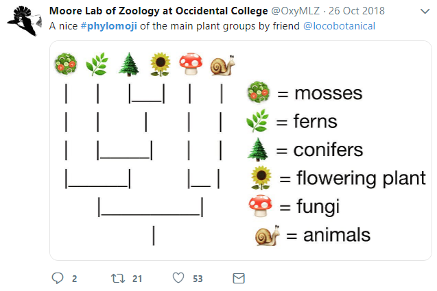
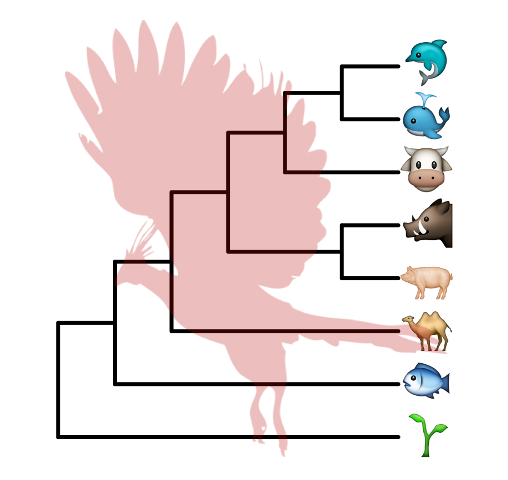

# Annotating Tree with Silhouette Images and Sub-plots {#chapter8}

```{r init, include=F}
library(knitr)
opts_chunk$set(message=FALSE, warning=FALSE, eval=TRUE, echo=TRUE, cache=TRUE)

library(ggimage)
library(ggplot2)
library(ggtree)
```

## Annotating Tree with Images {#ggimage}

We usually use text to label taxa, *i.e.* displaying taxa names. If the text is image file name (either local or remote), `r Biocpkg("ggtree")` can read the image and display the actual image as label of the taxa (Figure \@ref(fig:frogimage)). The `geom_tiplab` and `geom_nodelab` are capable to render silhouette image by internally called `r CRANpkg("ggimage")` package. 

Online tools such as `iTOL` [@letunic_interactive_2007] and `EvolView` [@he_evolview_2016] support displaying subplots on phylogenetic tree. However only bar and pie charts are supported by these tools. Users may want to visualize node-associated data with other visualization methods, such as violin plot [@grubaugh_genomic_2017], venn diagram [@lott_covenntree:_2015], sequence logo *etc*, and display them on the tree. In `r Biocpkg("ggtree")`, all kinds of subplots are supported as we can export all subplots to image files and use them to label corresponding nodes on the tree.

(ref:frogimagescap) Labelling taxa with images.

(ref:frogimagecap) **Labelling taxa with images.** 


```{r frogimage, fig.width=8.5, fig.height=7, message=F, warning=F, dev='png', dpi=200, fig.cap="(ref:frogimagecap)", fig.scap="(ref:frogimagescap)"}
library(ggimage)
library(ggtree)

nwk <- "((((bufonidae, dendrobatidae), ceratophryidae), (centrolenidae, leptodactylidae)), hylidae);"

x = read.tree(text = nwk)
ggtree(x) + xlim(NA, 7) + ylim(NA, 6.2) +
    geom_tiplab(aes(image=paste0("img/frogs/", label, '.jpg')), 
                geom="image", offset=2, align=2, size=.2)  + 
    geom_tiplab(geom='label', offset=1, hjust=.5) + 
    geom_image(x=.8, y=5.5, image="img/frogs/frog.jpg", size=.2)
```

## Annotating Tree with Phylopic {#phylopic}

[Phylopic](phylopic.org) contains more than 3200 silhouettes and covers almost all life forms. **ggtree** also supports using phylopic^[<https://twitter.com/guangchuangyu/status/593443854541434882>] to annotate the tree. Most importantly, we can color the image using numerical/categorical variable.


<!--
#```
tree <- ape::read.nexus("data/tree.nex")
phylopic_info <- data.frame(node = c(124, 113, 110, 96, 89, 70),
                            phylopic = c("c4ac9ea6-b465-4ed0-a5de-9fe4eebd3ef9",
                                        "5388a472-994a-48e1-86de-d988c6019e72",
                                        "615c82cf-fabe-49f8-b571-e8117edfa212",
                                        "63ff1b70-6b6e-4412-b4d2-b2e2fb51aa95",
                                        "d65d5abd-df8b-4509-912c-e42f6c34861f",
                                        "6d54acc7-9e1e-4b79-be88-4904cf58fbb5"),
                            species = c("galagoids", "lemurs", "tarsiers",
                                        "cebids", "hominoids", "cercopithecoids"))
pg <- ggtree(tree)
pg <- pg %<+% phylopic_info + 
  geom_nodelab(aes(image=phylopic, color=species, subset=!is.na(species)), 
              geom="phylopic", alpha = .6) + 
  theme(legend.position=c(.2, .8))
#```
-->

`r CRANpkg("ggimage")` package supports querying phylopic uid from scientific name, which is very handy for annotating tree with phylopic.

```{r ggimage_phylopic, dev='png'}
library(ggtree)
newick <- "((Pongo_abelii,(Gorilla_gorilla_gorilla,(Pan_paniscus,Pan_troglodytes)Pan,Homo_sapiens)Homininae)Hominidae,Nomascus_leucogenys)Hominoidea;"

tree <- read.tree(text=newick)

d <- ggimage::phylopic_uid(tree$tip.label)
d$body_mass = c(52, 114, 47, 45, 58, 6)

p <- ggtree(tree) %<+% d + 
  geom_tiplab(aes(image=uid, colour=body_mass), geom="phylopic", offset=2.5) +
  geom_tiplab(aes(label=label), offset = .2) + xlim(NA, 7) +
  scale_color_viridis_c()
```


(ref:phylopicscap) Labelling taxa with phylopic images. 

(ref:phylopiccap) **Labelling taxa with phylopic images.** ggtree will automatically download phylopic figures by querying provided UID. The figures can be colored using numerical or categorical values.
<!--  (A). The UID can be searched using scientific names of the taxa (B) -->

```{r phylopic, fig.width=6, figh.height=5, dev='png', fig.cap="(ref:phylopiccap)", fig.scap="(ref:phylopicscap)", echo=FALSE}
print(p)
# cowplot::plot_grid(pg, p, ncol=2, labels=LETTERS[1:2]) 
```

## Annotating Tree with Sub-plots {#subplots}


`ggtree` provides a layer, `geom_inset`, for adding subplots to a phylogenetic tree. The input is a named list of ggplot graphic objects (can be any kind of charts). These objects should named by node numbers. Users can also use `r CRANpkg("ggplotify")` to convert plots that generated by other functions (even implemented by base graphics) to ggplot objects, which can then be used in `geom_inset`. To facilitate adding bar and pie charts (e.g. summarized stats of results from ancestral reconstruction) to phylogenetic tree, `r Biocpkg("ggtree")` provides `nodepie` and `nodebar` functions to create a list of pie or bar charts.

### Annotate with bar charts

(ref:barInsetscap) Annotate internal nodes with barplots.

(ref:barInsetcap) **Annotate internal nodes with barplots.** 


```{r barInset, fig.width=10, fig.height=9.6, fig.cap="(ref:barInsetcap)", fig.scap="(ref:barInsetscap)"}
library(phytools)
data(anoletree)
x <- getStates(anoletree,"tips")
tree <- anoletree

cols <- setNames(palette()[1:length(unique(x))],sort(unique(x)))
fitER <- ape::ace(x,tree,model="ER",type="discrete")
ancstats <- as.data.frame(fitER$lik.anc)
ancstats$node <- 1:tree$Nnode+Ntip(tree)

## cols parameter indicate which columns store stats
bars <- nodebar(ancstats, cols=1:6)
bars <- lapply(bars, function(g) g+scale_fill_manual(values = cols))

tree2 <- full_join(tree, data.frame(label = names(x), stat = x ), by = 'label')
p <- ggtree(tree2) + geom_tiplab() +
    geom_tippoint(aes(color = stat)) + 
    scale_color_manual(values = cols) +
    theme(legend.position = "right") + 
    xlim(NA, 8)
p + geom_inset(bars, width = .08, height = .05, x = "branch") 
```


The *x* position can be one of 'node' or 'branch' and can be adjusted by the parameter *hjust* and *vjust* for horizontal and vertical adjustment respectively.


### Annotate with pie charts

Similarly, users can use `nodepie` function to generate a list of pie charts and place these charts to annotate corresponding nodes. Both `nodebar` and `nodepie` accepts parameter *alpha* to allow transparency.

(ref:pieInsetscap) Annotate internal nodes with pie plots.

(ref:pieInsetcap) **Annotate internal nodes with pie plots.** 


```{r pieInset, fig.width=10, fig.height=9.6, fig.cap="(ref:pieInsetcap)", fig.scap="(ref:pieInsetscap)"}
pies <- nodepie(ancstats, cols = 1:6)
pies <- lapply(pies, function(g) g+scale_fill_manual(values = cols))
p + geom_inset(pies, width = .1, height = .1) 
```


### Annotate with other types of charts

The `inset` function accepts a list of ggplot graphic objects and these input objects are not restricted to pie or bar charts. They can be any kinds of charts and hybrid of these charts.

(ref:barpieInsetscap) Annotate internal nodes with different types of subplots (bar and pie).

(ref:barpieInsetcap) **Annotate internal nodes with different types of subplots (bar and pie).** 


```{r barpieInset, fig.width=10, fig.height=9.6, fig.cap="(ref:barpieInsetcap)", fig.scap="(ref:barpieInsetscap)"}
pies_and_bars <- pies
i <- sample(length(pies), 20)
pies_and_bars[i] <- bars[i]
p + geom_inset(pies_and_bars, width=.08, height=.05)
```


## Have Fun with Phylomoji {#phylomoji}


[#phylomoji](https://twitter.com/hashtag/phylomoji?src=hash) is fun and it is internally supported by **ggtree** since 2015^[<https://twitter.com/guangchuangyu/status/662095056610811904> and <https://twitter.com/guangchuangyu/status/667337429704011777>].

Here, we will use **ggtree** to recreate the figure:

[](https://twitter.com/OxyMLZ/status/1055586178651451392)


(ref:phylomoji1scap) Parsing label as emoji.

(ref:phylomoji1cap) **Parsing label as emoji.** Text (*e.g.* node or tip labels) can be parsed as emoji. 


```{r phylomoji1, fig.width=7, fig.height=5, warning=F, dev='png', fig.cap="(ref:phylomoji1cap)", fig.scap="(ref:phylomoji1scap)"}
library(ggplot2)
library(ggtree)

tt = '((snail,mushroom),(((sunflower,evergreen_tree),leaves),green_salad));'
tree = read.tree(text = tt)
d <- data.frame(label = c('snail','mushroom', 'sunflower',
                          'evergreen_tree','leaves', 'green_salad'),
                group = c('animal', 'fungi', 'flowering plant',
                          'conifers', 'ferns', 'mosses'))

ggtree(tree, linetype = "dashed", size=1, color='firebrick') %<+% d + 
  xlim(0, 4.5) + ylim(0.5, 6.5) +
  geom_tiplab(parse="emoji", size=15, vjust=.25) +
  geom_tiplab(aes(label = group), geom="label", x=3.5, hjust=.5)
```

Note that the output may depends on what emoji fonts installed in your system^[Google Noto emoji fonts was installed in my system].

With `r Biocpkg("ggtree")`, it is easy to generate phylomoji. The emoji is treated as **text**, like abc. We can use emojis to label taxa, clade, color and rotate emoji with any given color and angle. This functionality is internally supported by the `r CRANpkg("emojifont")` package.

### Emoji in circular/fan layout tree

```{r fig.width=6, fig.height=6, warning=F, dev='png', eval=FALSE}
p <- ggtree(tree, layout = "circular", size=1) +  
  geom_tiplab(parse="emoji", size=10, vjust=.25)
print(p)

## fan layout  
p2 <- open_tree(p, angle=200) 
print(p2)

p2 %>% rotate_tree(-90)
```

(ref:emojifanscap) Phylomoji in cirular and fan layouts.

(ref:emojifancap) **Phylomoji in cirular and fan layouts.** 


```{r emojifan, fig.width=9.2, fig.height=7.3, warning=F, echo=F, dev='png', fig.cap="(ref:emojifancap)", fig.scap="(ref:emojifanscap)"}
p <- ggtree(tree, layout = "circular", size=1) +  
  geom_tiplab(parse="emoji", size=10, vjust=.25)

p2 <- open_tree(p, angle=200)
 
p2x <- ggplot() + ylim(0.5, 1) + xlim(0, 1) + theme_tree() +
  annotation_custom(ggplotGrob(p2), 
                    xmin=-.1, xmax=1.1, ymin=-.25, ymax=1.25)

p3 <- p2 %>% rotate_tree(-90) 
 
p3x <- ggplot() + ylim(0, 1) + xlim(0.5, 1) + theme_tree() +
  annotation_custom(ggplotGrob(p3), 
                    ymin=-.1, ymax=1.1, xmin=-.25, xmax=1.25)

a <- plot_grid(p, labels='A')
b <- plot_grid(p2x, labels='B')
c <- plot_grid(p3x, labels='C')
g <- ggplot() + xlim(0,1) + ylim(0,1) 

g + annotation_custom(ggplotGrob(c), xmin=.5, xmax=1, ymin=0, ymax=1) + 
  annotation_custom(ggplotGrob(b), xmin=0.005, xmax=.5, ymin=0, ymax=.3) + 
  annotation_custom(ggplotGrob(a), xmin=0, xmax=.5, ymin=.3, ymax=1) +
  theme_void()
```

Another example using `r Biocpkg("ggtree")` and `r CRANpkg("emojifont")` to produce phylogeny of plant emojis can be found on <https://github.com/ghuertaramos/PlantPhylomoji>.


### Emoji to label clades

(ref:emojicladescap) Emoji to label clades.

(ref:emojicladecap) **Emoji to label clades.** 


```{r emojiclade, fig.width=6, fig.height=5, dev='png', fig.cap="(ref:emojicladecap)", fig.scap="(ref:emojicladescap)"}
set.seed(123)
tr <- rtree(30)

ggtree(tr) + xlim(NA, 5.2) +
    geom_cladelabel(node=41, label="chicken", parse="emoji",
                    fontsize=12, align=TRUE, color="firebrick") +
    geom_cladelabel(node=53, label="duck", parse="emoji",
                    fontsize=12, align=TRUE, color="steelblue") +
    geom_cladelabel(node=48, label="family", parse="emoji",
                    fontsize=12, align=TRUE, color="darkkhaki")
```


### Apple Color Emoji

Although `R`'s graphical devices don't support `AppleColorEmoji` font, it's still possible to use it. We can export the `plot` to `svg` file and render it in `Safari`.


```r
library(ggtree)
tree_text <- "(((((cow, (whale, dolphin)), (pig2, boar)), camel), fish), seedling);"
x <- read.tree(text=tree_text)
library(ggimage)
library(gridSVG)
p <-  ggtree(x, size=2) + geom_tiplab(size=20, parse='emoji') +
    xlim(NA, 7) + ylim(NA, 8.5) +
    geom_phylopic(image="79ad5f09-cf21-4c89-8e7d-0c82a00ce728",
                  color="firebrick", alpha = .3, size=Inf)

p
ps = grid.export("emoji.svg", addClass=T)
```


(ref:applemojiscap) Use Apple Color Emoji in ggtree.

(ref:applemojicap) **Use Apple Color Emoji in ggtree.** 


```{r applemoji, out.width="80%", echo=F, fig.scap="(ref:applemojiscap)", fig.cap="(ref:applemojicap)"}

```

### Phylomoji in ASCII art

This is also possible, please refer to [Appendix D](#ascii-tree) for details.

