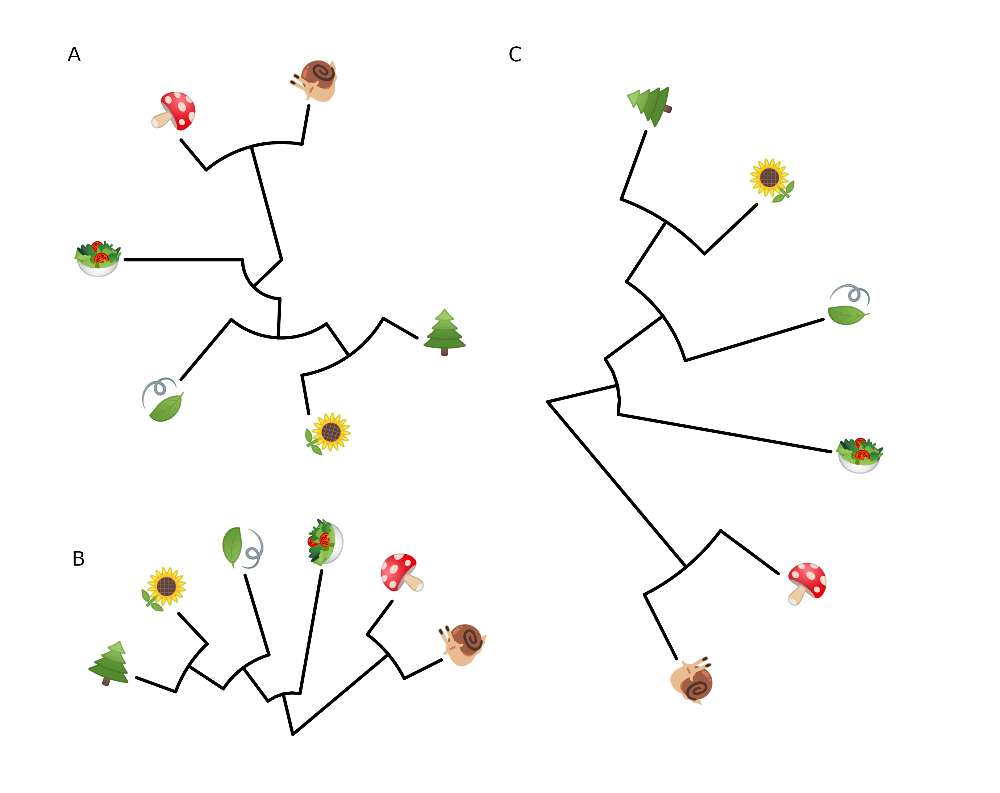

\newpage

# Annotating Tree with Silhouette Images and Sub-plots {#chapter8}

```{r init, include=F}
library(knitr)
opts_chunk$set(message=FALSE, warning=FALSE, eval=TRUE, echo=TRUE, cache=TRUE)

library(ggimage)
library(ggplot2)
library(ggtree)
```

## Annotating Tree with Images {#ggimage}

We usually use text to label taxa, *i.e.* displaying taxa names. If the text is the image file name (either local or remote), `r Biocpkg("ggtree")` can read the image and display the actual image as the label of the taxa (Figure \@ref(fig:frogimage)). The `geom_tiplab()` and `geom_nodelab()` are capable to render silhouette images by internally called the `r CRANpkg("ggimage")` package. 

Online tools such as `r pkg_itol` [@letunic_interactive_2007] and `r pkg_evolview` [@he_evolview_2016] support displaying subplots on a phylogenetic tree. However only bar and pie charts are supported by these tools. Users may want to visualize node-associated data with other visualization methods, such as violin plot [@grubaugh_genomic_2017], venn diagram [@lott_covenntree:_2015], sequence logo, *etc.*, and display them on the tree. In `r Biocpkg("ggtree")`, all kinds of subplots are supported as we can export all subplots to image files and use them to label corresponding nodes on the tree.

(ref:frogimagescap) Labelling taxa with images.

(ref:frogimagecap) **Labelling taxa with images.** Users need to specify `geom = "image"` and map the image file names onto the `image` aesthetics. 


```{r frogimage, fig.width=8, fig.height=6, message=F, warning=F, dev='png', dpi=150, fig.cap="(ref:frogimagecap)", fig.scap="(ref:frogimagescap)", out.width='100%'}
library(ggimage)
library(ggtree)

nwk <- paste0("((((bufonidae, dendrobatidae), ceratophryidae),",
          "(centrolenidae, leptodactylidae)), hylidae);")

imgdir <- system.file("extdata/frogs", package = "TDbook")

x = read.tree(text = nwk)
ggtree(x) + xlim(NA, 7) + ylim(NA, 6.2) +
    geom_tiplab(aes(image=paste0(imgdir, '/', label, '.jpg')), 
                geom="image", offset=2, align=2, size=.2)  + 
    geom_tiplab(geom='label', offset=1, hjust=.5) + 
    geom_image(x=.8, y=5.5, image=paste0(imgdir, "/frog.jpg"), size=.2)
```

## Annotating Tree with Phylopic {#phylopic}

[Phylopic](phylopic.org) contains more than 3200 silhouettes and covers almost all life forms. The `r Biocpkg("ggtree")` package supports using phylopic^[<https://twitter.com/guangchuangyu/status/593443854541434882>] to annotate the tree by setting `geom="phylopic"` and mapping phylopic UID to the `image` aesthetics. The `r CRANpkg("ggimage")` package supports querying phylopic UID from the scientific name, which is very handy for annotating tree with phylopic. In the following example, tip labels were used to query phylopic UID and phylopic images were used to label the tree as another layer of tip labels. Most importantly, we can color or resize the images using numerical/categorical variables and here the values of body mass were used to encode the color of the images (Figure \@ref(fig:phylopic)). 


<!--
#```
tree <- ape::read.nexus("data/tree.nex")
phylopic_info <- data.frame(node = c(124, 113, 110, 96, 89, 70),
                            phylopic = c("c4ac9ea6-b465-4ed0-a5de-9fe4eebd3ef9",
                                        "5388a472-994a-48e1-86de-d988c6019e72",
                                        "615c82cf-fabe-49f8-b571-e8117edfa212",
                                        "63ff1b70-6b6e-4412-b4d2-b2e2fb51aa95",
                                        "d65d5abd-df8b-4509-912c-e42f6c34861f",
                                        "6d54acc7-9e1e-4b79-be88-4904cf58fbb5"),
                            species = c("galagoids", "lemurs", "tarsiers",
                                        "cebids", "hominoids", "cercopithecoids"))
pg <- ggtree(tree)
pg <- pg %<+% phylopic_info + 
  geom_nodelab(aes(image=phylopic, color=species, subset=!is.na(species)), 
              geom="phylopic", alpha = .6) + 
  theme(legend.position=c(.2, .8))
#```

## optional: download the phylopic images
ggimage::download_phylopic(d$uid, destdir="data/phylopic", quiet=TRUE)

## to enable using downloaded files
## otherwise, geom_tiplab will try to read the online images
options(phylopic_dir = "data/phylopic")


-->


```{r ggimage_phylopic, eval=FALSE}
library(ggtree)
newick <- paste0("((Pongo_abelii,(Gorilla_gorilla_gorilla,(Pan_paniscus,",
          "Pan_troglodytes)Pan,Homo_sapiens)Homininae)Hominidae,",
          "Nomascus_leucogenys)Hominoidea;")

tree <- read.tree(text=newick)

d <- ggimage::phylopic_uid(tree$tip.label)
d$body_mass <- c(52, 114, 47, 45, 58, 6)

p <- ggtree(tree) %<+% d + 
  geom_tiplab(aes(image=uid, colour=body_mass), geom="phylopic", offset=2.5) +
  geom_tiplab(aes(label=label), offset = .2) + xlim(NA, 7) +
  scale_color_viridis_c()
```

<!--  (A). The UID can be searched using scientific names of the taxa (B) -->


(ref:phylopicscap) Labelling taxa with phylopic images. 

(ref:phylopiccap) **Labelling taxa with phylopic images.** The `r Biocpkg("ggtree")` will automatically download phylopic figures by querying provided UID. The figures can be colored using numerical or categorical values.


```{r phylopic, fig.width=6, figh.height=5, fig.cap="(ref:phylopiccap)", fig.scap="(ref:phylopicscap)", echo=FALSE}
# print(p)
# cowplot::plot_grid(pg, p, ncol=2, labels=LETTERS[1:2]) 
knitr::include_graphics("img/phylopic.png")
```

## Annotating Tree with Sub-plots {#subplots}


The `r Biocpkg("ggtree")` package provides a layer, `geom_inset()`, for adding subplots to a phylogenetic tree. The input is a named list of `ggplot` graphic objects (can be any kind of chart). These objects should be named by node numbers. Users can also use `r CRANpkg("ggplotify")` to convert plots generated by other functions (even implemented by base graphics) to `ggplot` objects, which can then be used in the `geom_inset()` layer. To facilitate adding bar and pie charts (*e.g.* summarized stats of results from ancestral reconstruction) to the phylogenetic tree, `r Biocpkg("ggtree")` provides the `nodepie()` and `nodebar()` functions to create a list of pie or bar charts.

### Annotate with bar charts


This example uses `ape::ace()` function to estimate ancestral character states. The likelihoods of the stats were visualized as stacked bar charts which were overlayed onto internal nodes of the tree using the `geom_inset()` layer (Figure \@ref(fig:pieInset)A). 


(ref:barInsetscap) Annotate internal nodes with barplots.

(ref:barInsetcap) **Annotate internal nodes with barplots.** 


```{r barInset, fig.width=10, fig.height=9.6, fig.cap="(ref:barInsetcap)", fig.scap="(ref:barInsetscap)", out.width='100%'}
library(phytools)
data(anoletree)
x <- getStates(anoletree,"tips")
tree <- anoletree

cols <- setNames(palette()[1:length(unique(x))],sort(unique(x)))
fitER <- ape::ace(x,tree,model="ER",type="discrete")
ancstats <- as.data.frame(fitER$lik.anc)
ancstats$node <- 1:tree$Nnode+Ntip(tree)

## cols parameter indicate which columns store stats
bars <- nodebar(ancstats, cols=1:6)
bars <- lapply(bars, function(g) g+scale_fill_manual(values = cols))

tree2 <- full_join(tree, data.frame(label = names(x), stat = x ), by = 'label')
p <- ggtree(tree2) + geom_tiplab() +
    geom_tippoint(aes(color = stat)) + 
    scale_color_manual(values = cols) +
    theme(legend.position = "right") + 
    xlim(NA, 8)
p1 <- p + geom_inset(bars, width = .08, height = .05, x = "branch") 
```


The `x` position can be one of 'node' or 'branch' and can be adjusted by the parameters, `hjust` and `vjust`, for horizontal and vertical adjustment respectively. The `width` and `height` parameters restict the size of the inset plots. 


### Annotate with pie charts

Similarly, users can use the `nodepie()` function to generate a list of pie charts and place these charts to annotate corresponding nodes (Figure \@ref(fig:pieInset)B). Both `nodebar()` and `nodepie()` accept a parameter of `alpha` to allow transparency. 

(ref:pieInsetscap) Annotate internal nodes with bar or pie charts.

(ref:pieInsetcap) **Annotate internal nodes with bar or pie charts.** Using bar charts (A) or pie charts (B) to display summary statistics of internal nodes. 


```{r pieInset, fig.width=16, fig.height=9.6, fig.cap="(ref:pieInsetcap)", fig.scap="(ref:pieInsetscap)", out.width='100%'}
pies <- nodepie(ancstats, cols = 1:6)
pies <- lapply(pies, function(g) g+scale_fill_manual(values = cols))
p2 <- p + geom_inset(pies, width = .1, height = .1) 

plot_list(p1, p2, guides='collect', tag_levels='A')
```


### Annotate with mixed types of charts

The `geom_inset()` layer accepts a list of 'ggplot' graphic objects and these input objects are not restricted to pie or bar charts. They can be any kind of charts or hybrid of these charts. The `geom_inset()` is not only useful to display ancestral stats, but also applicable to visualize different types of data that are associated to selected nodes in the tree. Here, we use a mixure of pie and bar charts to annotate the tree as an example (Figure \@ref(fig:barpieInset)).

(ref:barpieInsetscap) Annotate internal nodes with different types of subplots.

(ref:barpieInsetcap) **Annotate internal nodes with different types of subplots.** 


```{r barpieInset, fig.width=10, fig.height=9.6, fig.cap="(ref:barpieInsetcap)", fig.scap="(ref:barpieInsetscap)", out.width='100%'}
pies_and_bars <- pies
i <- sample(length(pies), 20)
pies_and_bars[i] <- bars[i]
p + geom_inset(pies_and_bars, width=.08, height=.05)
```


## Have Fun with Phylomoji {#phylomoji}

Phylomoji is a phylogenetic tree of emoji. It is fun^[<https://twitter.com/hashtag/phylomoji?src=hash>] and very useful for education of the evolution concept. The `r Biocpkg("ggtree")` supports producing phylomoji since 2015^[<https://twitter.com/guangchuangyu/status/662095056610811904> and <https://twitter.com/guangchuangyu/status/667337429704011777>]. Here, we will use `r Biocpkg("ggtree")` to recreate the following phylomoji figure^[<https://twitter.com/OxyMLZ/status/1055586178651451392>]:

[](https://twitter.com/OxyMLZ/status/1055586178651451392)


(ref:phylomoji1scap) Parsing label as emoji.

(ref:phylomoji1cap) **Parsing label as emoji.** Text (*e.g.* node or tip labels) can be parsed as emoji. 


```{r eval=FALSE}
library(ggplot2)
library(ggtree)

tt = '((snail,mushroom),(((sunflower,evergreen_tree),leaves),green_salad));'
tree = read.tree(text = tt)
d <- data.frame(label = c('snail','mushroom', 'sunflower',
                          'evergreen_tree','leaves', 'green_salad'),
                group = c('animal', 'fungi', 'flowering plant',
                          'conifers', 'ferns', 'mosses'))

p <- ggtree(tree, linetype = "dashed", size=1, color='firebrick') %<+% d + 
  xlim(0, 4.5) + ylim(0.5, 6.5) +
  geom_tiplab(parse="emoji", size=15, vjust=.25) +
  geom_tiplab(aes(label = group), geom="label", x=3.5, hjust=1)
```

```{r phylomoji1, fig.width=7, fig.height=5, warning=F, fig.cap="(ref:phylomoji1cap)", fig.scap="(ref:phylomoji1scap)", out.width='100%', echo=FALSE}
knitr::include_graphics("img/phylomoji-ggtree.png")

#if (knitr::is_html_output()) {
#  print(p)
#} else {
#  knitr::include_graphics("img/phylomoji-ggtree.png")
#} 
```


Note that the output may depend on what emoji fonts is installed in your system^[Google Noto emoji fonts was installed in my system].

With `r Biocpkg("ggtree")`, it is easy to generate phylomoji. The emoji is treated as text, like 'abc'. We can use emojis to label taxa, clade, color and rotate emoji with any given color and angle. This functionality is internally supported by the `r CRANpkg("emojifont")` package.

### Emoji in circular/fan layout tree

```{r fig.width=6, fig.height=6, warning=F, dev='png', eval=FALSE}
p <- ggtree(tree, layout = "circular", size=1) +  
  geom_tiplab(parse="emoji", size=10, vjust=.25)
print(p)

## fan layout  
p2 <- open_tree(p, angle=200) 
print(p2)

p2 %>% rotate_tree(-90)
```

(ref:emojifanscap) Phylomoji in cirular and fan layouts.

(ref:emojifancap) **Phylomoji in cirular and fan layouts.** 


```{r emojifan, fig.width=9.2, fig.height=7.3, warning=F, echo=F, fig.cap="(ref:emojifancap)", fig.scap="(ref:emojifanscap)", out.width='100%'}
if (FALSE) {
p <- ggtree(tree, layout = "circular", size=1) +  
  geom_tiplab(parse="emoji", size=10, vjust=.25)

p2 <- open_tree(p, angle=200)
 
p2x <- ggplot() + ylim(0.5, 1) + xlim(0, 1) + theme_tree() +
  annotation_custom(ggplotGrob(p2), 
                    xmin=-.1, xmax=1.1, ymin=-.25, ymax=1.25)

p3 <- p2 %>% rotate_tree(-90) 
 
p3x <- ggplot() + ylim(0, 1) + xlim(0.5, 1) + theme_tree() +
  annotation_custom(ggplotGrob(p3), 
                    ymin=-.1, ymax=1.1, xmin=-.25, xmax=1.25)

a <- plot_list(p, labels='A')
b <- plot_list(p2x, labels='B')
c <- plot_list(p3x, labels='C')
g <- ggplot() + xlim(0,1) + ylim(0,1) 

gg <- g + annotation_custom(ggplotGrob(c), xmin=.5, xmax=1, ymin=0, ymax=1) + 
  annotation_custom(ggplotGrob(b), xmin=0.02, xmax=.5, ymin=0, ymax=.3) + 
  annotation_custom(ggplotGrob(a), xmin=0, xmax=.5, ymin=.4, ymax=1) +
  theme_void()

ggsave(gg, filename = "img/phylomoji-ggtree-circular.png", 
      width=9.2, height=7.3, bg='white')

}




# print(gg)
#if (knitr::is_html_output()) {
#  print(gg)
#} else {
#  
#}
```


Another example using `r Biocpkg("ggtree")` and `r CRANpkg("emojifont")` to produce phylogeny of plant emojis can be found in a scientific article [@escudero_grand_2020].


### Emoji to label clades


Parsing clade labels as emojis is also supported in the `geom_cladelab()` layer. For example, in a phylogenetic tree of influenza viuses, we can use emojis to label clades to represent host species similar to Figure \@ref(fig:emojiclade). 

(ref:emojicladescap) Emoji to label clades.

(ref:emojicladecap) **Emoji to label clades.** 


```{r emojiclade, fig.width=6, fig.height=5, fig.cap="(ref:emojicladecap)", fig.scap="(ref:emojicladescap)", out.width='100%'}
set.seed(123)
tr <- rtree(30)

dat <- data.frame(
           node = c(41, 53, 48),
           name = c("chicken", "duck", "family")
       )

p <- ggtree(tr) + 
     xlim(NA, 5.2) +
     geom_cladelab(
         data = dat,
         mapping = aes(
             node = node, 
             label = name, 
             color = name
         ),
         parse = "emoji",
         fontsize = 12,
         align = TRUE,
         show.legend = FALSE
     ) +
     scale_color_manual(
         values = c(
             chicken="firebrick", 
             duck="steelblue", 
             family = "darkkhaki"
         )
     )
p
```


### Apple Color Emoji

Although `R`'s graphical devices don't support `AppleColorEmoji` font on MacOS, it's still possible to use it. We can export the `plot` to a `svg` file and render it in `Safari`.

```r
library(ggtree)
tree_text <- paste0("(((((cow, (whale, dolphin)), (pig2, boar)),",
                    "camel), fish), seedling);")
x <- read.tree(text=tree_text)
library(ggimage)
p <-  ggtree(x, size=2) + geom_tiplab(size=20, parse='emoji') +
    xlim(NA, 7) + ylim(NA, 8.5) 

svglite::svglite("emoji.svg", width = 10, height = 7)
print(p)
dev.off()

# or use `grid.export()` 
# ps = gridSVG::grid.export("emoji.svg", addClass=T)
```


(ref:applemojiscap) Use Apple Color Emoji in `ggtree`.

(ref:applemojicap) **Use Apple Color Emoji in `ggtree`.** The tip labels were parsed as emojis using `AppleColorEmoji` font in Safari. 


```{r applemoji, out.width="100%", echo=F, fig.scap="(ref:applemojiscap)", fig.cap="(ref:applemojicap)"}
knitr::include_graphics("img/apple_emoji.png", auto_pdf = TRUE)
```

### Phylomoji in ASCII art

Producing phylomoji as an ASCII art is also possible. Users can refer to [Appendix D](#ascii-tree) for details.

## Summary {#summary8}

The `r Biocpkg("ggtree")` supports parsing labels, including tip labels, internal node labels, and clade labels, as images, math expression, and emoji, in case the labels can be parsed as image file names, `plotmath` expression, or emoji names respectively. It can be fun, but it's also very useful for scientific research. The use of images on phylogenetic trees can help to present species-related characteristics, including morphological, anatomical, and even macromolecular structures. Moreover, `r Biocpkg("ggtree")` supports summarizing statistical inferences (*e.g.*, biogeographic range reconstruction and posterior distribution) or associated data of the nodes as subplots to be displayed on a phylogenetic tree. 


