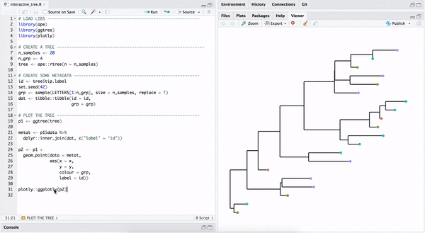
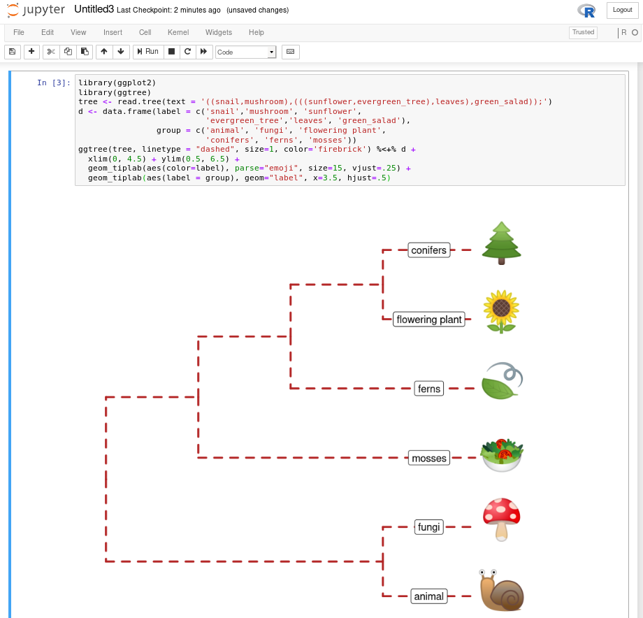

# Related tools {#related-tools}

## MicrobiotaProcess: Convert *taxonomy* or hierachical clustering result to *treedata* {#MicrobiotaProcess-hierarchical}

In `microbiome` or `ecological data`, the *taxonomy* names are widely used to visualized their hierarchical relationship with associated dataset. However, the *taxonomy* names often are promiscuous and omissive. `convert_to_treedata` of `r Biocpkg("MicrobiotaProcess")` solves the problem well. It can automatically extract their upper level taxonomic information to complete it, when some *taxonomy* names are confused and missing. It also can convert the information to a *treedata* object, which can be visualized by `r Biocpkg("ggtree")`.

(ref:TaxaToTreescap) Get a hierachical clustering tree with the taxonomy names.

(ref:TaxaToTreecap) Get a hierachical clustering tree with the taxonomy names.

```{r TaxaTree, fig.widht=8, fig.height=8, fig.cap="(ref:TaxaToTreecap)", fig.scap="ref:TaxaToTreescap"}
library(MicrobiotaProcess)
library(ggtree)
data(kostic2012crc)
taxa <- data.frame(kostic2012crc@tax_table, check.names=FALSE)

tree <- convert_to_treedata(data=taxa)

p <- ggtree(tree, layout="circular", size=0.2) +
     geom_tiplab(size=1)
p
```

## rtol: An R interface to Open Tree API {#rtol}

`r CRANpkg("rtol")` [@michonneau_rotl:_2016] is an R package to interact with the Open Tree of Life data APIs. 

(ref:rotlSubtreescap) Get an induced subtree from the big Open Tree.

(ref:rotlSubtreecap) **Get an induced subtree from the big Open Tree.**


```{r rotlSubtree, fig.width=8, fig.height=6, fig.cap="(ref:rotlSubtreecap)", fig.scap="(ref:rotlSubtreescap)", out.width='100%'} 
## example from: https://github.com/ropensci/rotl
library(rotl)
apes <- c("Pongo", "Pan", "Gorilla", "Hoolock", "Homo")
(resolved_names <- tnrs_match_names(apes))
tr <- tol_induced_subtree(ott_ids = ott_id(resolved_names))
ggtree(tr) + geom_tiplab() + xlim(NA, 5)
```


## Convert ggtree to plotly object {#plotly}

One way to make quick interactive phylogenetic tree is using `r Biocpkg("ggtree")` with the `r CRANpkg("plotly")` package. The [ggplotly()](https://plotly-r.com/improving-ggplotly.html) is able to convert `ggtree` object to a `plotly` object. Note that the `r Biocpkg("ggtree")` package also supports interactive manipulation of phylogenetic tree via the [identify()](#identify) method.


```r
# example from https://twitter.com/drandersgs/status/965996335882059776

# LOAD LIBS ---------------------------------------------------------------
library(ape)
library(ggtree)
library(plotly)
# CREATE A TREE -------------------------------------------------------------
n_samples <- 20
n_grp <- 4
tree <- ape::rtree(n = n_samples)
# CREATE SOME METADATA ----------------------------------------------------
id <- tree$tip.label
set.seed(42)
grp <- sample(LETTERS[1:n_grp], size = n_samples, replace = T)
dat <- tibble::tibble(id = id,
                      grp = grp)
# PLOT THE TREE -----------------------------------------------------------
p1 <- ggtree(tree)
metat <- p1$data %>%
  dplyr::inner_join(dat, c('label' = 'id'))
p2 <- p1 +
  geom_point(data = metat,
             aes(x = x,
                 y = y,
                 colour = grp,
                 label = id))
plotly::ggplotly(p2)
```


(ref:ggtreeplotlyscap) Interactive phylogenetic tree by combining ggtree with plotly.

(ref:ggtreeplotlycap) **Interactive phylogenetic tree by combining ggtree with plotly.**


```{r ggtreeplotly, fig.cap="(ref:ggtreeplotlycap)", fig.scap="(ref:ggtreeplotlyscap)", echo=FALSE, out.width='100%'} 

```


## Comic (xkcd-like) phylogenetic tree {#commicR}


```{r ggsvg, fig.show='hide'}
library(htmltools)    
library(XML)    
library(gridSVG)    
library(ggplot2)    
library(ggtree)
library(comicR)    

p <- ggtree(rtree(30), layout="circular")  +
    geom_tiplab(aes(label=label), color="purple")
print(p)
svg <- grid.export(name="", res=100)$svg
```

(ref:comicRscap) Remove image background.

(ref:comicRcap) **Remove image background.** Plotting silhouette images on phylogenetic tree without (A) and with (B) background remove.


```{r comicR} 
tagList(
    tags$div(
             id = "ggtree_comic",
             tags$style("#ggtree_comic text {font-family:Chalkduster;}"),
             HTML(saveXML(svg)),
             comicR("#ggtree_comic", ff=5)
         )
) # %>% html_print
```


## Print ASCII-art rooted tree {#ascii-tree}

```{r asciiTree, comment=NA}
library(data.tree)
tree <- rtree(10)
d <- as.data.frame(as.Node(tree))
names(d) <- NULL
print(d, row.names=FALSE)
```

It is neat to print ASCII-art of phylogeny. Sometimes we don't want to plot the tree, but just take a glance at the tree structure without leaving the focus from R console. However, it is not a good idea to print the whole tree as ASCII text if the tree is large. Sometimes we just want to look at a specific portion of the tree and their immediate relatives. At this scenario, we can use `treeio::tree_subset()` function (see [session 2.4](subsetting-tree-with-data)) to extract selected portion of a tree. Then we can print ASCII-art of the tree subset to explore evolutionary relationship of interested species in R console.

`r Biocpkg("ggtree")` supports parsing tip labels as emoji to create [phylomoji](#phylomoji). With the `r CRANpkg("data.tree")` and `r CRANpkg("emojifont")` packages, we can also print phylomoji as ASCII text.

```{r asciiTreeEmoji, comment=NA}
library(emojifont)

tt <- '((snail,mushroom),(((sunflower,evergreen_tree),leaves),green_salad));'
tree <- read.tree(text = tt)
tree$tip.label <- emoji(tree$tip.label)
d <- as.data.frame(as.Node(tree))
names(d) <- NULL
print(d, row.names=FALSE)
```


Another way to print ASCII-art pf phylogeny is to use the `ascii()` device defined in [devout](https://github.com/coolbutuseless/devout) package. Here is an example:

```{r devout-ascii, comment=NA}
library(devout)
ascii(width=80)
ggtree(rtree(5))
invisible(dev.off())
```


## Zoom in selected portion {#facet-zoom}


(ref:facetZoomscap) Zoom in selected clade.

(ref:facetZoomcap) **Zoom in selected clade.**


```{r facetZoom, fig.width=6, fig.height=4, fig.cap="(ref:facetZoomcap)", fig.scap="(ref:facetZoomscap)"}
set.seed(2019-08-05)
x <- rtree(30)
nn <- tidytree::offspring(x, 43, self_include=TRUE)
ggtree(x) + ggforce::facet_zoom(xy = node %in% nn)
```


## Tips for using `ggtree` with `ggimage` {#ggimage-tips}

`r Biocpkg("ggtree")` supports annotating tree with silhouette images via the `r CRANpkg("ggimage")` package. `r CRANpkg("ggimage")` provides grammar of graphic syntax to work with image files. It allows processing images on the fly via the `image_fun` parameter, which accepts a function to process `magick-image` object. The `r CRANpkg("magick")` package provides several functions and these functions can be combined to perform a particular task.

### Example 1: Remove background of images {#ggimage-rm-image-bg}

(ref:ggimagebgscap) Remove image background.

(ref:ggimagebgcap) **Remove image background.** Plotting silhouette images on phylogenetic tree without (A) and with (B) background remove.


```{r ggimagebg, fig.width=8, fig.height=4, fig.cap="(ref:ggimagebgcap)", fig.scap="(ref:ggimagebgscap)", out.width='100%'} 
set.seed(1982)
x <- rtree(5)
p <- ggtree(x) + theme_grey()
p1 <- p + geom_nodelab(image="img/frogs/frog.jpg", geom="image", size=.12) + 
          ggtitle("original image")
p2 <- p + geom_nodelab(image="img/frogs/frog.jpg", geom="image", size=.12,
            image_fun= function(.) magick::image_transparent(., "white")) + 
            ggtitle("image with background removed")
plot_grid(p1, p2, ncol=2)
```

### Example 2: Plot tree on a background image {#ggimage-bgimage}

The `geom_bgimage` add a layer of the image and put the layer to the bottom of the layer stack. It is a normal layer and doesn't change the structure of the output `ggtree` object. Users can add annotation layers as without the background image layer.

(ref:bgimagescap) Use image file as tree background.

(ref:bgimagecap) **Use image file as tree background.**


```{r bgimage, fig.width=6, fig.height=4, fig.cap="(ref:bgimagecap)", fig.scap="(ref:bgimagescap)"} 
ggtree(rtree(20), size=1.5, color="white") + 
  geom_bgimage('img/blackboard.jpg') + 
  geom_tiplab(color="white", size=5, family='xkcd')
```


## Run ggtree in Jupyter notebook

If you have [Jupyter notebook](https://jupyter.org/) installed on your system, you can install [IRkernel](https://irkernel.github.io/) with the following command in R:

```r
install.packages("IRkernel")
IRkernel::installspec()
```

Then you can use ggtree and other R packages in Jupyter notebook. Here is a screenshot of recreating Figure \@ref(fig:phylomoji1) in Jupyter notebook.

(ref:jupyterscap) ggtree in Jupyter notebook.

(ref:jupytercap) **ggtree in Jupyter notebook.** Running ggtree in Jupyter notebook via R kernel. 


```{r jupyter, echo=F, fig.cap="(ref:jupytercap)", fig.scap="(ref:jupyterscap)", out.width='100%'}
## htmltools::includeHTML("img/ggtree_jupyter.html")

```


