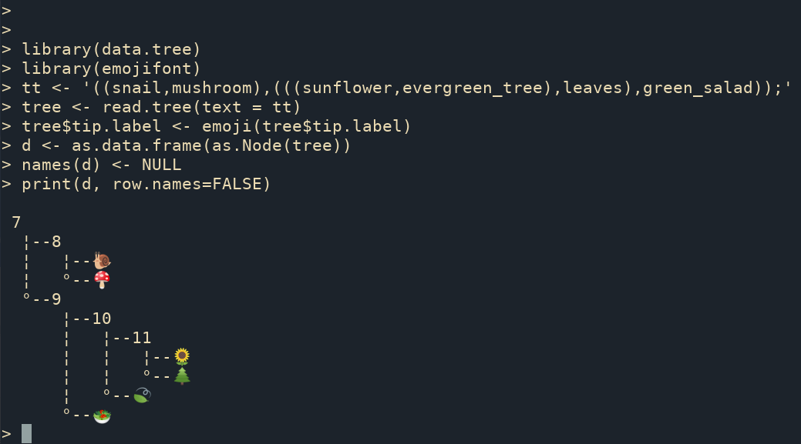

\newpage


# Related tools {#related-tools}

## MicrobiotaProcess: Convert taxonomy table to a `treedata` object {#MicrobiotaProcess-taxonomy}

Taxonomy (genus, family, ...) data are widely used in microbiome or ecology. Hierarchical taxonomies are the tree-like structure that organizes items into subcategories and can be converted to a tree object (see also the [phylog object](#phylog)). The `r Biocpkg("MicrobiotaProcess")` supports converting a `taxonomyTable` object, defined in the `r Biocpkg("phyloseq")` package, to a `treedata` object, and the taxonomic hierarchical relationship can be visualized using `r Biocpkg("ggtree")`. When there are taxonomy names that are [confused and missing](https://github.com/YuLab-SMU/MicrobiotaProcess/issues/14), the `as.treedata()` method for `taxonomyTable` objects will complete their upper-level taxonomic information automatically.  


(ref:TaxaToTreescap) Convert a `taxonomyTable` object to a `treedata` object. 

(ref:TaxaToTreecap) **Convert a `taxonomyTable` object to a `treedata` object.** 

```{r TaxaTree, fig.widht=8, fig.height=8, fig.cap="(ref:TaxaToTreecap)", fig.scap="ref:TaxaToTreescap"}
library(MicrobiotaProcess)
library(ggtree)

# The original kostic2012crc is a MPSE object
data(kostic2012crc)
# Converting it (MPSE) to phyloseq object
kostic2012crc %<>% as.phyloseq()
taxa <- phyloseq::tax_table(kostic2012crc)
tree <- as.treedata(taxa)

ggtree(tree, layout="circular", size=0.2) +
     geom_tiplab(size=1)
```

## rtol: An R interface to Open Tree API {#rtol}

The `r CRANpkg("rtol")` [@michonneau_rotl:_2016] is an R package to interact with the Open Tree of Life data APIs. 

(ref:rotlSubtreescap) Get an induced subtree from the big Open Tree.

(ref:rotlSubtreecap) **Get an induced subtree from the big Open Tree.**


```{r rotlSubtree, fig.width=8, fig.height=6, fig.cap="(ref:rotlSubtreecap)", fig.scap="(ref:rotlSubtreescap)", out.width='100%'} 
## example from: https://github.com/ropensci/rotl
library(rotl)
apes <- c("Pongo", "Pan", "Gorilla", "Hoolock", "Homo")
(resolved_names <- tnrs_match_names(apes))
tr <- tol_induced_subtree(ott_ids = ott_id(resolved_names))
ggtree(tr) + geom_tiplab() + xlim(NA, 5)
```


```{r, eval = !knitr::is_latex_output(), child="ggtree-plotly.Rmd"}
```


```{r, eval = !knitr::is_latex_output(), child="ggtree-comicR.Rmd"}
```


## Print ASCII-art rooted tree {#ascii-tree}

```{r asciiTree, comment=NA}
library(data.tree)
tree <- rtree(10)
d <- as.data.frame(as.Node(tree))
names(d) <- NULL
print(d, row.names=FALSE)
```

It is neat to print ASCII-art of the phylogeny. Sometimes we don't want to plot the tree, but just take a glance at the tree structure without leaving the focus from the R console. However, it is not a good idea to print the whole tree as ASCII text if the tree is large. Sometimes we just want to look at a specific portion of the tree and its immediate relatives. At this scenario, we can use `treeio::tree_subset()` function (see [session 2.4](subsetting-tree-with-data)) to extract selected portion of a tree. Then we can print ASCII-art of the tree subset to explore the evolutionary relationship of the species of our interest in the R console.

The `r Biocpkg("ggtree")` supports parsing tip labels as emoji to create [phylomoji](#phylomoji). With the `r CRANpkg("data.tree")` and `r CRANpkg("emojifont")` packages, we can also print phylomoji as ASCII text.


```{r asciiTreeEmoji, comment=NA, eval=FALSE}
library(data.tree)
library(emojifont)

tt <- '((snail,mushroom),(((sunflower,evergreen_tree),leaves),green_salad));'
tree <- read.tree(text = tt)
tree$tip.label <- emoji(tree$tip.label)
d <- as.data.frame(as.Node(tree))
names(d) <- NULL
print(d, row.names=FALSE)
```


(ref:emojidatatreescap) Print phylomoji as ASCII text.

(ref:emojidatatreecap) **Print phylomoji as ASCII text.**


```{r emojidatatree, fig.cap="(ref:emojidatatreecap)", fig.scap="(ref:emojidatatreescap)", out.width='100%'} 

```

Another way to print ASCII-art of phylogeny is to use the `ascii()` device defined in the [devout](https://github.com/coolbutuseless/devout) package. Here is an example:

```{r devout-ascii, comment=NA}
library(devout)
ascii(width=80)
ggtree(rtree(5))
invisible(dev.off())
```


## Zoom in the selected portion {#facet-zoom}


In addition to using `viewClade()` function, users can use the `r CRANpkg("ggforce")` package to zoom in a selected clade. 

(ref:facetZoomscap) Zoom in a selected clade.

(ref:facetZoomcap) **Zoom in a selected clade.**


```{r facetZoom, fig.width=6, fig.height=4, fig.cap="(ref:facetZoomcap)", fig.scap="(ref:facetZoomscap)"}
set.seed(2019-08-05)
x <- rtree(30)
nn <- tidytree::offspring(x, 43, self_include=TRUE)
ggtree(x) + ggforce::facet_zoom(xy = node %in% nn)
```


## Tips for using `ggtree` with `ggimage` {#ggimage-tips}

The `r Biocpkg("ggtree")` supports annotating a tree with silhouette images via the `r CRANpkg("ggimage")` package. The `r CRANpkg("ggimage")` provides the grammar of graphic syntax to work with image files. It allows processing images on the fly via the `image_fun` parameter, which accepts a function to process `magick-image` objects. The `r CRANpkg("magick")` package provides several functions and these functions can be combined to perform a particular task.

### Example 1: Remove background of images {#ggimage-rm-image-bg}

(ref:ggimagebgscap) Remove image background.

(ref:ggimagebgcap) **Remove image background.** Plotting silhouette images on a phylogenetic tree without (A) and with (B) background remove.


```{r ggimagebg, fig.width=8, fig.height=4, fig.cap="(ref:ggimagebgcap)", fig.scap="(ref:ggimagebgscap)", out.width='100%'} 
library(ggimage)

imgdir <- system.file("extdata/frogs", package = "TDbook")

set.seed(1982)
x <- rtree(5)
p <- ggtree(x) + theme_grey()
p1 <- p + geom_nodelab(image=paste0(imgdir, "/frog.jpg"), 
                        geom="image", size=.12) + 
      ggtitle("original image")
p2 <- p + geom_nodelab(image=paste0(imgdir, "/frog.jpg"), 
            geom="image", size=.12,
            image_fun= function(.) magick::image_transparent(., "white")) + 
      ggtitle("image with background removed")
plot_grid(p1, p2, ncol=2)
```

### Example 2: Plot tree on a background image {#ggimage-bgimage}

The `geom_bgimage()` adds a layer of the image and puts the layer to the bottom of the layer stack. It is a normal layer and doesn't change the structure of the output `ggtree` object. Users can add annotation layers without the background image layer.

(ref:bgimagescap) Use an image file as a tree background.

(ref:bgimagecap) **Use an image file as a tree background.**


```{r bgimage, fig.width=6, fig.height=4, fig.cap="(ref:bgimagecap)", fig.scap="(ref:bgimagescap)"} 
ggtree(rtree(20), size=1.5, color="white") + 
  geom_bgimage('img/blackboard.jpg') + 
  geom_tiplab(color="white", size=5, family='xkcd')
```


## Run ggtree in Jupyter notebook

If you have [Jupyter notebook](https://jupyter.org/) installed on your system, you can install [IRkernel](https://irkernel.github.io/) with the following command in R:

```r
install.packages("IRkernel")
IRkernel::installspec()
```

Then you can use `r Biocpkg("ggtree")` and other R packages in the Jupyter notebook. Here is a screenshot of recreating Figure \@ref(fig:phylomoji1) in the Jupyter notebook.

(ref:jupyterscap) ggtree in Jupyter notebook.

(ref:jupytercap) **ggtree in Jupyter notebook.** Running ggtree in Jupyter notebook via R kernel. 


```{r jupyter, echo=F, fig.cap="(ref:jupytercap)", fig.scap="(ref:jupyterscap)", out.width='100%'}
## htmltools::includeHTML("img/ggtree_jupyter.html")
knitr::include_graphics("img/Screenshot_2019-06-24_ggtree-jupyter.png")
```


