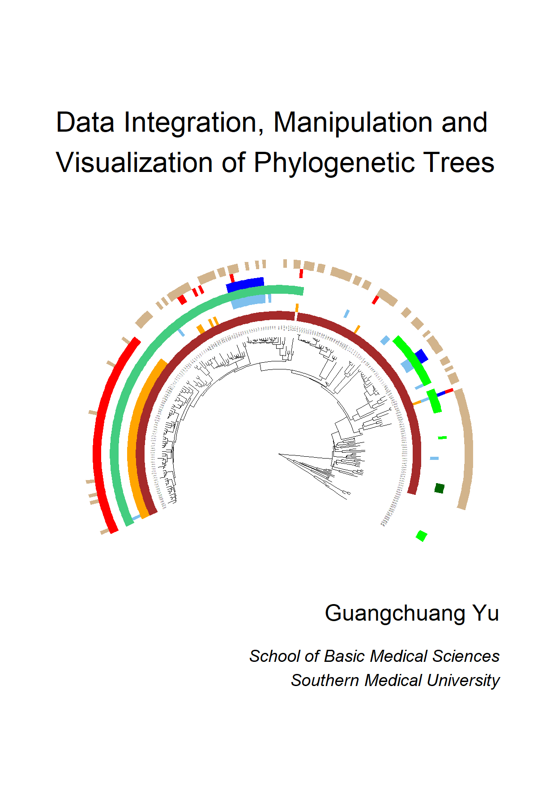

```{r include=FALSE}
source("setup.R")

options(
  htmltools.dir.version = FALSE, formatR.indent = 2, width = 55, digits = 4
)

options(tinytex.clean = FALSE)

## manual setting. the ropenscilabs/icons package will set up everything for you.
## fontawesome supports
## htmltools::tagList(rmarkdown::html_dependency_font_awesome())
## icons::download_fontawesome()

library(knitr)
#knit_hooks$set(crop = hook_pdfcrop)

opts_chunk$set(message=FALSE, warning=FALSE, eval=TRUE, 
            echo=TRUE, cache=TRUE, out.width="98%",
            fig.process=svg2png)

if (knitr::is_latex_output()) {
    opts_chunk$set(dev = "cairo_pdf")
} else {
    opts_chunk$set(dev = "svg")
}

```

<!--
# Welcome {-}

 This is the online work-in-progress book of "Data Integration, Manipulation and Visualization of Phylogenetic Trees". This book gives your all the details of using the ggtree package suite to handle tree with data. The book is written by Guangchuang Yu.


<center>

</center>

-->

\newpage
\frontmatter
# Preface {-}

I am so excited to have this book published. The book is meant as a guide for data integration, manipulation and visualization of phylogenetic trees using a suite of R packages, `r CRANpkg("tidytree")`, `r Biocpkg("treeio")`, `r Biocpkg("ggtree")` and `r Biocpkg("ggtreeExtra")`. Hence, if you are starting to read this book, we assume you have a working knowledge of how to use R and `r CRANpkg("ggplot2")`. 

The development of the `r Biocpkg("ggtree")` package started during my PhD study at the University of Hong Kong. I joined the State Key Laboratory of Emerging Infectious Diseases (SKLEID) under the supervision of Yi Guan and Tommy Lam. I was asked to provide assistance to modify the newick tree string to incorporate some additional information, such as amino acid substitutions, in the internal node labels of the phylogeny for visualization. I wrote an R script to do it and soon realized that most phylogenetic tree visualization software can only display one type of data through node labels. Basically, we cannot display two data variables at the same time for comparative analysis. In order to produce tree graphs displaying different types of branch/node associated information, such as bootstrap values and substitutions, people mostly relied on post-processing image software. This situation motivates me to develop `r Biocpkg("ggtree")`. First of all, I think a good user interface must fully support the `r CRANpkg("ggplot2")` syntax, which allows us to draw graphs by superimposing layers. In this way, simple graphs are simple, and complex graphs are just a combination of simple layers, which are easy to generate. 

After several years of development, `r Biocpkg("ggtree")` has evolved into a package suite, including `r CRANpkg("tidytree")` for manipulating tree with data using the tidy interface; `r Biocpkg("treeio")` for importing and exporting tree with richly annotated data; `r Biocpkg("ggtree")` for tree visualization and annotation and `r Biocpkg("ggtreeExtra")` for presenting data with a phylogeny side-by-side for a rectangular layout or in outer rings for a circular layout. The `r Biocpkg("ggtree")` is a general tool that supports different types of tree and tree-like structures and can be applied to different disciplines to help researchers presenting and interpreting data in the evolutionary or hierarchical context. 


## Structure of the book {-}


+ Part I (Tree data input, output and manipulation) describes `r Biocpkg("treeio")` package for tree data input and output, and `r CRANpkg("tidytree")` package for tree data manipulation.
+ Part II (Tree data visualization and annotation) introduces tree visualization and annotation using the grammar of graphic syntax implemented in the `r Biocpkg("ggtree")` package. It emphasizes presenting tree-associated data on the tree.
+ Part III (ggtree extensions) introduces `r Biocpkg("ggtreeExtra")` for presenting data on circular layout trees and other extensions including `r Biocpkg("MicrobiotaProcess")` and `r Biocpkg("tanggle")` *etc*.
+ Part IV (Miscellaneous topics) describes utilities provided by the `r Biocpkg("ggtree")` package suite and presents a set of reproducible examples.


```{r, child="software-info.md"}
```

## Acknowledgments {-}

Many people have contributed to this book with spelling and grammar corrections. I'd particularly like to thank Shuangbin Xu, Lin Li and Xiao Luo for their detailed technical reviews of the book, and Tiao You for designing the front cover of the book. 

Many others have contributed during the development of the `r Biocpkg("ggtree")` package suite. I would like to thank Hadley Wickham, for creating the `r CRANpkg("ggplot2")` package that `r Biocpkg("ggtree")` relies on; Tommy Tsan-Yuk Lam and Yi Guan for being great advisors and supporting the development of `r Biocpkg("ggtree")` during my PhD; Richard Ree for inviting me to catalysis meeting on phylogenetic tree visualization; William Pearson for inviting me to publish a protocol paper of `r Biocpkg("ggtree")` in the *Current Procotols in Bioinformatics* journal; Shuangbin Xu, Yonghe Xia, Justin Silverman, Bradley Jones, Watal M. Iwasaki, Ruizhu Huang, Casey Dunn, Tyler Bradley, Konstantinos Geles, Zebulun Arendsee and many others who have contributed source code or given me feedback; and last, but not least, the members of the `r Biocpkg("ggtree")` mailing list^[<https://groups.google.com/forum/#!forum/bioc-ggtree>], for providing many challenging problems that have helped improve the `r Biocpkg("ggtree")` package suite. 
